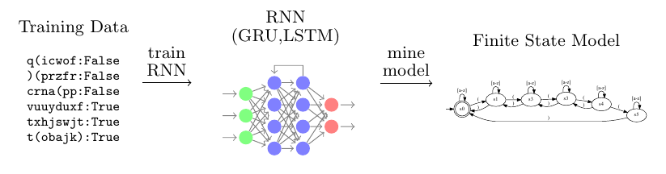

## TAYSIR Competition - Black-box testing oriented model extraction from discrete input RNNs and transformers

This repository contains all data required to reproduce models extracted from RNNs and transformers during TAYSIR competition.
All models were submitted under username `EdiMuskardin`. 

This work is joint collaboration between Edi Muskardin and Martin Tappler.

Repository Structure
- extraction_classifier.py - used to extract models for Track 1
- extraction_regression.py - used to extract models for Track 2. Contains an abstraction mapper.
- SULs.py - SUL classes for all types of networks for both tracks
- utils.py - utility functions
- compact_submission.py - helper file used to create compact submissions
- extract_from_submitted_models.py - helper file which helped us reverse engineer our submissions

All learned models (extracted from submission files) can be found in `learned_models` directory.
They can be loaded and visualized with AALpy.

## Track 1 - Binary Classification

### Result Summary

| Dataset | Error Rate | Model Size | Notes |
|---------|------------|------------|-------|
| 1       | 0.075      | 7708         |    most likely context free   |
| 2       | 0          | 8 (10 with strong oracle)        |   regular    |
| 3       | 0          | 9         |   regular    |
| 4       | 0          | 5         |   regular    |
| 5       | 0          | 5         |    regular   |
| 6       | 0.0002     | 18         |   can find many cex with strong oracle    |
| 7       | 0          | 2         |   transformer, 2 states    |
| 8       | 0.32       | Unrelated to accuracy         |     Unknown structure  |
| 9       | 0.007      | 200         |    No regular representation   |
| 10      | 0.014      | 1500         |     No regular representation  |
| 11      | 0.007       | 500         |   Consider only len(val) < 100    |

## Track 2 - Language Modelling/Regression

Output mapper that maps concerete network outputs to discrete set of interval means 
is implemented in `NaivePartitioning` class in the extraction_regression.py.

### Result Summary

| Dataset | Error Rate | Model Size | Learning Parameters |
|---------|------------|------------|---------------------|
| 1       | 0.175      | 866         |    500 LR, 200 intervals                 |
| 2       | 0.0097     | 131         |          100 LR, 10 intervals           |
| 3       | 0.00003     | 110         |     50 LR, 10 intervals                |
| 4       | 0.000006   | 105         |        50LR, 10 intervals            |
| 5       | 0.00000007 | 123         |         50 LR, 12 intervals           |
| 6       | 0.1971      | 318         |      200 LR, 20 intervals               |
| 7       | 0.0      | 170         |       100 LR, 15 intervals        |
| 8       | 0.0443     | 162         |     100 LR,   15 intervals           |
| 9       | 0.0        | 55         | 30 LR, 10 intervals      |
| 10      | 0.1237      | 1412         | 200 LR, 20 intervals           |

** LR == Learning rounds